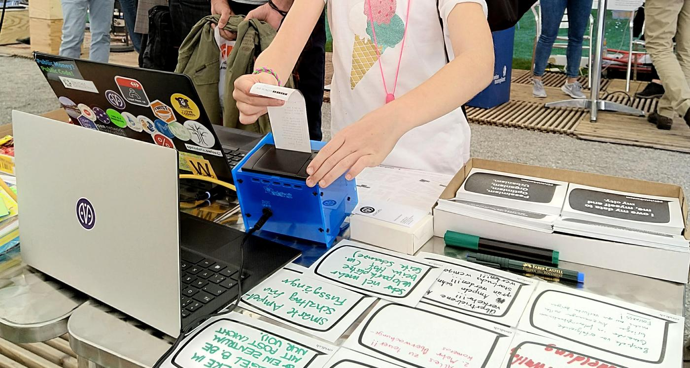

##### The Swiss Digital Day took place for the third time on 3 September. Companies and institutions from all over the country were concerned with the goal of bringing the population closer to digitalisation. And, with support of the [Digital Impact Network](https://www.digitalimpact.ch), we had the privilege to take *cividi* right in the action packed middle, rubbing shoulders with the best of 'em!

In the inner courtyard of the GenerationenHaus, surrounded by urban gardens just a few steps from the SBB main railway station in Bern, we presented the topic _digital tools for analogue spaces_. Around us, the other exhibitors, which included [Smart City Bern](https://www.digitaltag.swiss/programm/die-intelligente-stadt-wie-engagieren-sich-ngos-startups-und-bevolkerung/), [Digital Impact Network](https://www.digitaltag.swiss/partner/digital-impact-network/), [Insel Gruppe](https://www.digitaltag.swiss/programm/insel-mit-herz/), [Swisscom](https://www.digitaltag.swiss/programm/virtueller-gemeindeschalter/), [BFH](https://www.digitaltag.swiss/programm/via-digital-lab-zum-master-of-digital-business-administration/), [BEKB](https://www.digitaltag.swiss/programm/digitale-trends-im-banken-sektor/), [We Are Cube](https://www.digitaltag.swiss/programm/was-macht-die-digitalisierung-mit-dir/), among others, were showing off what is already possible, what's up next in the pipeline of transformative (dare we still say, disruptive?) technologies, and what the intelligent public should be aware of when it comes to intelligent machines.

<blockquote class="twitter-tweet">

Erster Fieldtest zu <a href="https://twitter.com/hashtag/civicurbanism?src=hash&amp;ref_src=twsrc%5Etfw">#civicurbanism</a> mit dem <a href="https://twitter.com/hashtag/Datenspaziergang?src=hash&amp;ref_src=twsrc%5Etfw">#Datenspaziergang</a> gestern beim <a href="https://twitter.com/hashtag/DigitalTagBern?src=hash&amp;ref_src=twsrc%5Etfw">#DigitalTagBern</a>. Hat Spass gemacht mit 5-90-jährigen über die Digitalisierung zu reden. Merssi viumau allen fürs Mitmachen und die Unterstützung durch <a href="https://twitter.com/impacthubbern?ref_src=twsrc%5Etfw">@impacthubbern</a>. <a href="https://twitter.com/hashtag/SwissDigitalDay?src=hash&amp;ref_src=twsrc%5Etfw">#SwissDigitalDay</a> <a href="https://twitter.com/dgt_switzerland?ref_src=twsrc%5Etfw">@dgt_switzerland</a>
&mdash; cividi (@cividitech) <a href="https://twitter.com/cividitech/status/1169277627502407686?ref_src=twsrc%5Etfw">September 4, 2019</a></blockquote>

At our stand we showed the versatile possibilities of digital planning and data exchange, with live demos of the [SmartUse.ch](https://smartuse.ch) portal that we built initially for the metropolitan region of Zürich - though much work on it took place in Bern co-working spaces - and which we hope to serve as inspiration and more for [Haupstadtregion](https://hauptstadtregion.ch/) and other regions! We got generally enthusiastic responses, particularly from people who liked maps and interactive things, and even several visitors with deep domain knowledge who asked hairy questions and shared pointed advice.

On the topic of maps and interactive things:

A highlight of our booth was [HappyLil'PrintrPi](https://bitbucket.org/cividi/happylilprintrpi/src/master/README.md), first deployed at [Criterion 2019](https://cividi.be/blog/en/2019-04-26) and a trusty companion to our team at public events ever since. It created randomly-generated missions on demand, always within a 5 minute walking radius, in the form of receipts like this one:

In order to give everyone the opportunity to experience the topic on site in the centre of Berne, these self-guided data walks encouraged [spatial orientation awareness](https://www.gislounge.com/spatial-orientation-and-the-brain-the-effects-of-map-reading-and-navigation/), and through them we got lots of great ideas from people who took the missions and filled out our #CivicUrbanism cards with their discoveries and demands.

On top of that, we designed the custom map (shown above) of the area around the GenerationenHaus which was distributed at the infodesk and our booth. It highlighted urban features like car-free roads, rail and tram tracks, co-working spaces, and encouraged map users to submit corrections and discoveries with an online service and QR code inspired by [Field Papers](http://fieldpapers.org/).

Last but not least, our custom designed poster pictured in the tweet up on top takes a twisted look at the lay of the land. Here, from a bird's eye, we see the city. What do YOU see? Stay tuned as we build on these first trials combining the digital and analogue in creative, critical ways.

🚀

If you didn't make it to Bern on Digital Day: no problem! The event organizers Digital Switzerland have a [YouTube channel](https://youtu.be/V-gOB5cbhmQ) on which live contributions of [#SwissDigitalDay](https://twitter.com/hashtag/SwissDigitalDay?src=hash&amp;ref_src=twsrc%5Etfw) were streamed. Further information on the entire program can be found on the [official website](https://www.digitaltag.swiss/) and across social and more [old fashioned](https://www.schweizer-illustrierte.ch/people/talk-town/der-video-livestream-aus-bern-und-zurich) media. Thank you to Impact Hub Bern, especially Pablo, Jessica and team, and to everyone present and behind the scenes of Digitaltag for the support.
